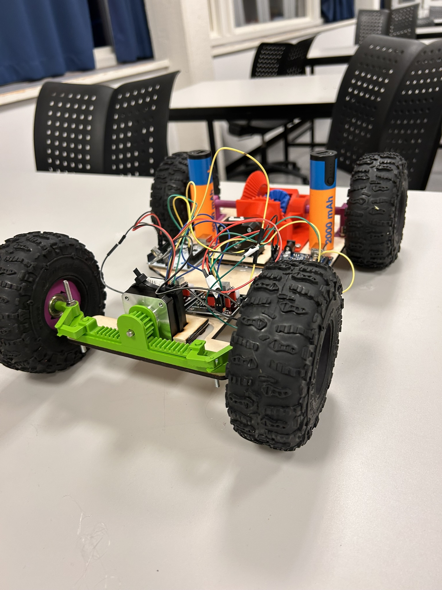
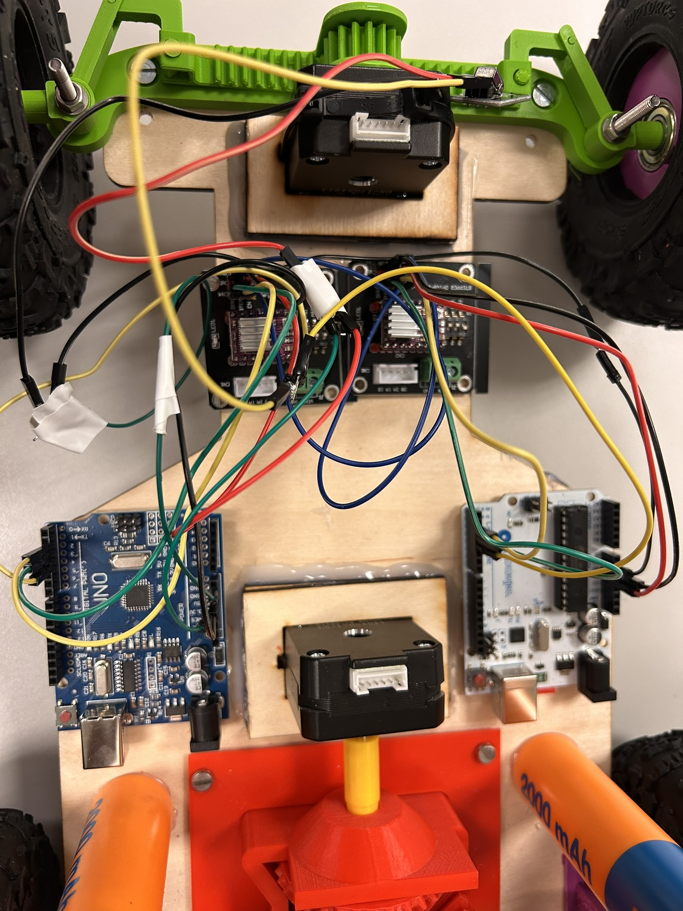

# Fjernstyrt bil-prosjekt med Arduino
[Norsk](./README.md) | [English](./README_EN.md)

Dette er et prosjekt laget for "Teknologi og Forskningslære" 1 ved Sotra Videregående Skule. Det er skrevet en [rapport](#rapport) som går mer i dybde på hele prosjektet.

## Bilder
 

## Rapport
Dette prosjektet er ikke fullført.

## Lisens
Lisensiert under MIT-lisensen; vennligst se [lisensfilen](./LICENSE.md) for vilkår.
